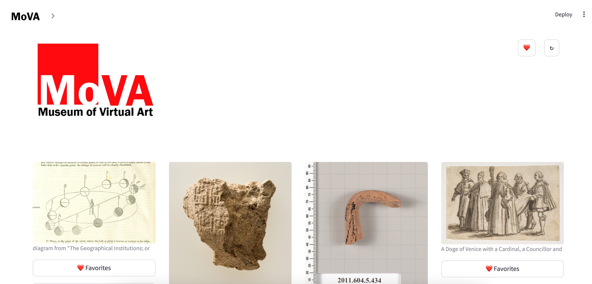

## MoVa Streamlit App

## How to Run the App Locally

[](#)

### 1\. Clone the Git Repo

[](#)

First, to obtain a local copy of our repository, run the following `git` command:

```shell
git clone https://github.com/madiforman/virtual_art_museum.git
```

[](#)

### 2\. Local Environment Setup

[](#)

Next, install our `conda` environment `vamenv` as specified in the file `environment.yml`:

```shell
conda env create -f environment.yml
```

Once the Conda environment is created, it can be activated and deactivated with the following commands:

```shell
conda activate vamenv
conda deactivate
```

[](#)

### 3\. Local Environment Setup

Let's begin! Open the virtual_art_museum folder inside our virtual_art_museum directory and run this command:

```shell
streamlit run mova_home.py
```
Your browser should open the new tab with our MoVA's Home Page:



You can access the images from MET Museum and Europeana in one place now! WOW!


The user has an ability to add the images to Favorites and click the button for more details:


While adding to your Favorites, you will be notified by the message in the green box (if added successfully, 
yellow - if this image is already in  your Favorites).


Clicking on the Details button will give you more information about the art piece:


Additionally, our app allows you to play with different filters to choose the most suitable art:


At the top right corner we installed a Favorites page and Refresh button so that you can update the list of images on the main:


If you click on this lovely red heart, it will bring you to our Favorites page. Here you have an opportunity to Download and Remove images.


Downloaded Favorites image would look like that:


I hope you find it useful!
